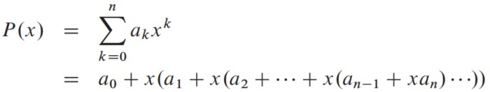

## Horners_Rule
### 1. Problem Set-up

-Input: The value for **x** and all its efficients.

-Output: Calculate the polynomial expression:



### 2. Pseudocode
```
*HORNELS_RULE(x, A)*
y = 0
for i = n downto 0
  y = A[i] + x * y
```
### 3. Algorithm Analysis
